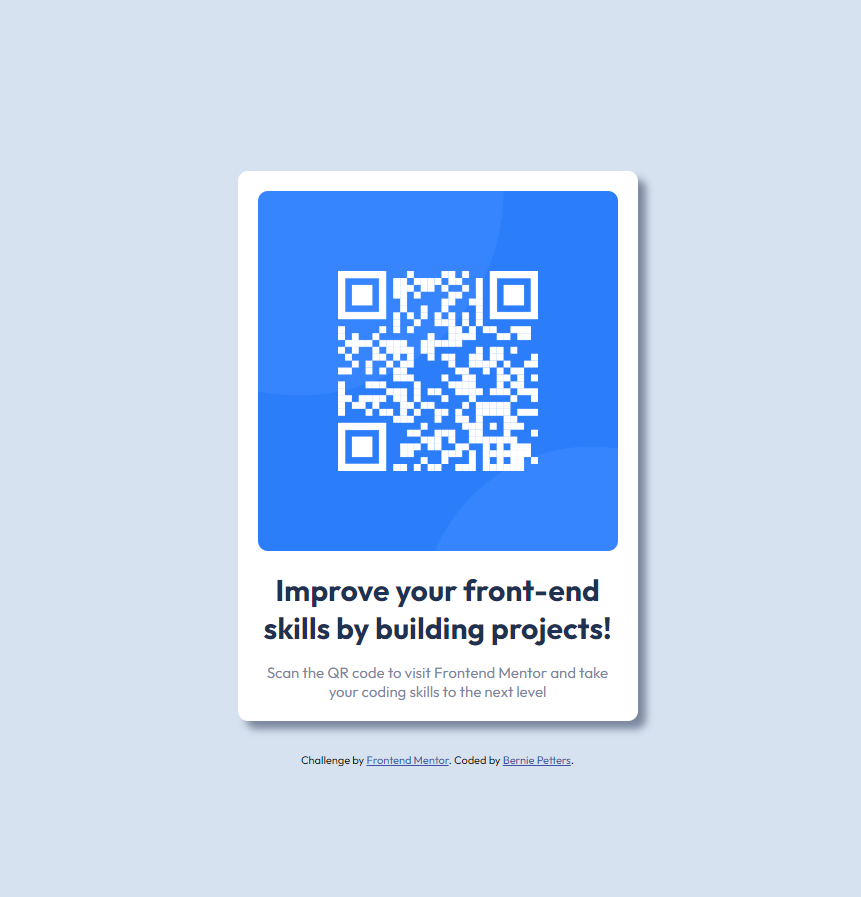

# Frontend Mentor - QR code component

This is a solution to the [QR code component challenge on Frontend Mentor](https://www.frontendmentor.io/challenges/qr-code-component-iux_sIO_H).

Frontend Mentor challenges help you improve your coding skills by building realistic projects.

## Table of contents

- [Frontend Mentor - QR code component](#frontend-mentor---qr-code-component)
  - [Table of contents](#table-of-contents)
  - [Overview](#overview)
    - [Screenshot](#screenshot)
    - [Links](#links)
  - [My process](#my-process)
    - [Built with](#built-with)
  - [Author](#author)

## Overview

- Using this challenge to refresh my front-end skills.

### Screenshot

### Links

- Solution URL: [Code](https://your-solution-url.com)
- Live Site URL: [Demo](https://your-live-site-url.com)

## My process

Facing this challenge, I referenced the sample picture to wire-frame the plan.
Once I had that, I constructed the HTML then finished by fleshing out the CSS in a seperate style sheet.

### Built with

- Semantic HTML5 markup
- CSS custom properties
- Flexbox
- Mobile-first workflow
- Google Fonts

## Author

- Website - [Bernie Petters](https://www.your-site.com)
- Frontend Mentor - [@bp4924](https://www.frontendmentor.io/profile/bp4924)
- LinkedIn - [Bernie Petters](<https://(https://www.linkedin.com/in/bernie-petters)>)
